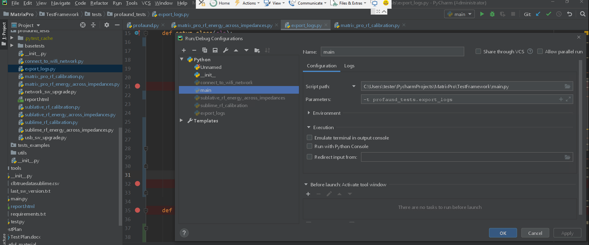

# IDE


## Jupiter Notebook

### Installation

```{python}

# Podstawowa instalacja
pip install jupyter


# Doinstalowanie dodatków
# https://jupyter-contrib-nbextensions.readthedocs.io/en/latest/install.html

# package installation
pip install jupyter_contrib_nbextensions

# This step copies the nbextensions’ javascript and css files into the jupyter server’s search directory, and edits some jupyter config files
jupyter contrib nbextension install --user

# enabling and disabling extansions: wykonuje sie to w samym jupyterze z zakladce 'nbextensions'


```


### Connecting with Venv

https://janakiev.com/blog/jupyter-virtual-envs/  (Using Virtual Environments in Jupyter Notebook and Python)

Zakladam ze jupyter jest juz zainstlowany na komputerze.
```{python}

# po utworzeniu venv-a aktywujemy i doinstalowujemy w nim pakiet:
pip install --user ipykernel  / pip install ipykernel -U

# teraz dodajemy naszego venv-a do jupytera (caly czas venv jest aktywowany)
python -m ipykernel install --user --name=myenv
# Po wykonaniu powyzszego polecenia w katalogu venv-a powinien pojawić się plik kernel.json

# teraz kernela moge wyklikac w jupyterze.

```


Usuwanie venv z pythona

```{python}

# listuje kernele w pythonie
jupyter kernelspec list

# odinstalowuje:
jupyter kernelspec uninstall myenv

```


### Magic commends
```{python}

# execute python files (exivalent for exex('file.py'))
%run 'file.py'


```


### Global settings

```{python}


# change code cells width
from IPython.display import display, HTML
display(
HTML(data = """
<style>
  div#notebook-container {width: 75%;}
  div#menubar-container {width: 65%;}
  div#maintoolbar-container {width: 55%;}
</style>

"""))

# display all outputs
from IPython.core.interactiveshell import InteractiveShell
InteractiveShell.ast_node_interactivity = 'all'


# pandas DataFrame displayed outpu size
import pandas as pd
pd.options.display.max_rows = 100
pd.options.display.max_columns = 20


# jakie sa aktualne ustawienia
pd.options.display.max_rows
pd.options.display.max_columns

```

### Converting to different formats

```{python}

# HTML with table of contents and hidden code (kod uruchamiany w terminalu)
jupyter nbconvert --to=html szcieka_pliku.jpynb --TemplateExporter.exclude input=TRUE --template toc2

```

### widgets 

```{python}

```


## Jupiter Lab

### Installation

```{python}

pip install jupyterlab


# extensions
# wczesniej trzeba miec zainstalowany Nodejs

```


## PyCharm


### Konfiguracja Git i GitHub
File -> Settings -> Version Control -> Git/GitHub

### Dodanie Git do istniejącego projektu
Dodawanie z poziomu PyCharma Git to istniejącego projektu:
VCS -> Import into Version Control -> Create Git Repository

### Zmiana skrotow
File->settings->Keymap
Skrot do odpalania zaznaczonego kodu w skrypcie nazywa się : 'Execution Selection ... '
Skrot do autouzupelniania nazywa sie: 'autocompletion'

### Podpinanie do vevn
1. Tworze nowy projekt
2. W opcjach projektu podpinam odpowiedniego Pythona


### Ustawienia globalne a ustawienia projektu
Ustawienia projektu są podpunktem w ustawieniach globalnych: File->settings->Project:nazwa_projektu


### Uzyteczne skroty
Ctrl+P - jakie argumenty ma funkcji (wywolujemy kiedy kursor jest w nawiasach)
Ctrl+Shift+I - kod funkcji
Ctrl+q - szybkie informacje na temat funkcji


### Srodowiska w linuxie:


### debuggowanie
Zanim zaczniemy debuggowac nalezy:
1. Run->Edit Configurations-> + (plus po prawej na dole) -> Python. Teraz w tym samym oknie po lewej stronie znakiem plus dodaje konfiguracje pliku do debuggowania (+ -> Python). Dodaje przede wszystkim sciezke do debuggowanego pliku. Bez tego debugger-a nie bedzie sie dalo aktywowac.
https://www.youtube.com/watch?v=sRGpvbhOhQs

Dodawania sciezki do debuggowanego pliku:



```{python}

```


## Rstudio

Opcje zwiazaje z wyswietlaniem DataFrames
```{python}

pd.set_option('precision', 3)
pd.set_option('display.float_format', lambda x: '%20.3f' % x)
pd.options.display.float_format = '{:,}'.format
pd.options.display.max_columns  = 100
pd.options.display.max_rows     = 500
pd.options.display.max_colwidth = 30

```


